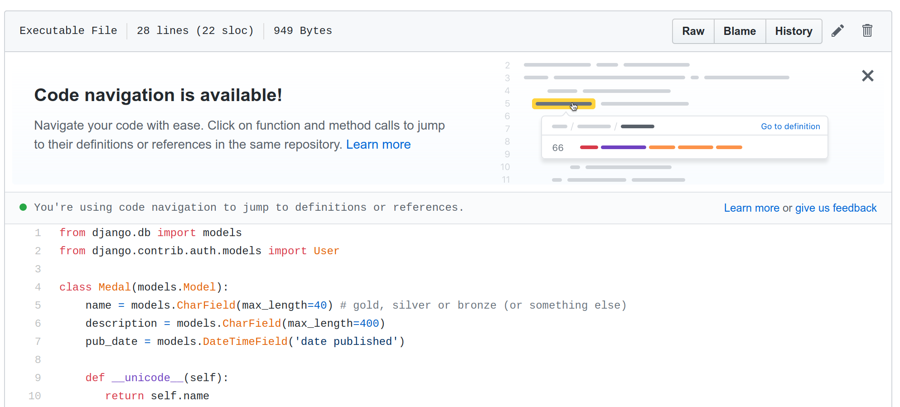

The Perl Foundation provides grants for work that is valuable to the Perl and Raku communities.

* If you are looking to work on a grant to help the community, take a look at this list.
* If you have suggestions for useful work (whether for the communities or for the languages), please [open an issue](https://github.com/tpf/grants-perlfoundation-org/issues) or [submit a pull request](https://github.com/tpf/grants-perlfoundation-org/pulls) and, once approved, it will show up here.

While we try to keep this list relevant, things can easily get out of date. Before grabbing a task, check that a similar investment is not done recently.

⚠️ *Disclaimer* The list does not guarantee that TPF will fund any grant proposal based on them. This is still subject to a vote.

# Perl

## Perl core

### [readpipe(LIST)](https://rjbs.manxome.org/rubric/entry/1964) (from @rjbs)

From the Perl todo:

> system() accepts a LIST syntax (and a PROGRAM LIST syntax) to avoid running a shell. readpipe() (the function behind qx//) could be similarly extended.


### [Unused lexicals](https://rjbs.manxome.org/rubric/entry/1964) (from @rjbs)

From the Perl todo:

This warns:

```bash
$ perl -we '$pie = 42'
  Name "main::pie" used only once: possible typo at -e line 1.
```

This does not:

```bash
$ perl -we 'my $pie = 42'
Logically all lexicals used only once should warn, if the user asks for warnings. An unworked RT ticket (#5087) has been open for eleven years for this discrepancy.
```

### [pack and unpack on streams](http://blogs.perl.org/users/makoto_nozaki/2015/07/grant-idea---pack-and-unpack-on-streams.html) (from @tux)

Currently, `pack` and `unpack` work on a string, which means that you have to move forward in the data-string yourself, if the full data-format is not known in advance, but depends on data seen so far.

If one could `unpack` on a stream, one could `unpack` the picture that is known, have the stream pointer move forward the amount of data read from the given picture, and be ready to read the next data based on a next, possibly different) picture.

Extreme "win" can be taken where the size of the data being read for a given picture is differing per architecture, like native floats.

## CPAN

### [PSGI protocol for HTTP::Tiny](https://perl-foundation-outreach.github.io/gsoc-2020-ideas/perl/HTTP-Tiny-PSGI.html)

Enhance [HTTP::Tiny](https://metacpan.org/pod/HTTP::Tiny) to support it communicating via [PSGI](https://metacpan.org/pod/PSGI). The primary use case being to assist in testing. See also [LWP::Protocol::PSGI](https://metacpan.org/pod/LWP::Protocol::PSGI) and [Furl::PSGI](https://metacpan.org/pod/Furl::PSGI).

### [Net::Google::Calendar authentication failure](https://rt.cpan.org/Public/Bug/Display.html?id=100421)

This library no longer works as it uses the Calendar v2 API which [Google discontinued](https://developers.googleblog.com/2014/07/upgrade-now-to-calendar-apiv3.html). It needs to be updated to the [new API](https://developers.google.com/calendar/) (v3).

### [Module to handle OData](http://blogs.perl.org/users/makoto_nozaki/2015/07/grant-idea---odata.html) (from Alex aka ASB)

We (the Perl community) currently do not have a CPAN module that handles [OData](https://www.odata.org/). There seems to be an attempt to do it in [OData::Client](https://github.com/mrallen1/OData-Client) but it's not finished yet, and I fit doesn't get a care taker, it will never be done. Also, there is client and server parts. Let's get both :)

Side node: Eventually, I'm too dumb to see that we don't need one because Perl can do it out oft he box. But if this is the case, eventuelly, it would be a good idea to put up a grant to create a document describing how to use OData with Perl (like this one).

## Tooling
### [Update PPI for more recent constructs](https://rjbs.manxome.org/rubric/entry/1964) (from @rjbs)

Last I looked, [PPI](https://metacpan.org/pod/PPI) couldn't handle much newer than Perl *v5.10* or *v5.12*. I don't have a comprehensive list of the stuff it can't do, but it wouldn't be tiny. Make it all work.

### Push to have Perl support in github code navigation

Github is currently the major *social network for developers* and provides a good exposure for the Perl modules/code and a nice tool for helping Perl developers (both coding and CI/CD through github actions or travis ci, circle ci or whatever).

Github is experimenting/putting in place the code navigation.

Below the alert to introduce this new feature to developers :



And next a real life working example : 


It is available since november 2019 (see the [annoucement](https://github.blog/changelog/2019-11-13-code-navigation-is-now-available-for-all-go-python-and-ruby-repositories/)) and I guess it will grow as this feature is just a "must have" for developers (we have multiple code browsers in my company : bitbucket native, grok and woboq !).

The [doc of github](https://help.github.com/en/github/managing-files-in-a-repository/navigating-code-on-github) says that it is based on [semantic](https://github.com/github/semantic) which does not support Perl as of today.

The purpose of this grant would be to :
* Implement Perl support in [semantic](https://github.com/github/semantic)
* Push Github folks to enable it (first as experimental) - maybe it could be discussed even before implementation :

It is written in haskell (and in the past Perl and Haskell folks were good friends right ? :P)

## Documentation
### [DBIx::Class re-documentation](http://blogs.perl.org/users/makoto_nozaki/2015/07/grant-idea---dbixclass-re-documentation.html) (from @ribasushi)

Fixing up the *better-than-most-but-still-terrible* documentation of DBIC is a ~200 person-hour undertaking, which on top of that requires someones fresh eye. 

Given that [DBIx::Class](https://metacpan.org/pod/DBIx::Class) is a "staple-module" in the contemporary Perl ecosystem, I believe it is reasonable to expect for the TPF to "pick up the tab" if someone with the right qualifications steps up.

## External site

### [BountySource has a few ideas on Perl](https://www.bountysource.com/teams/perl/issues)

# Raku

## Raku core

## Raku ecosystem

### SparrowHub

[SparrowHub](http://repo.westus.cloudapp.azure.com/hub) is a repository of [Sparrow](https://github.com/melezhik/Sparrow6) plugins - reusable scripts for various automation tasks. Plugins are written on many languages and get run eithor by `cli` or through a programmatic Raku API. Both Raku and Perl community might gain an advantage of plugins eco system easing developers life. SparrowHub could be thought as a MetaCPAN/Raku modules but with more practical approach - find a plugin and run it straight away. It's dead easy to create new plugins and distribute them. 

So a proposal is:

* Finishing SparrowHub site development ( site UI improvements, getting better DNS name, logo creation, so on )
* Finishing plugins migration to a new version of Sparrow ( see this [roadmap](https://github.com/melezhik/Sparrow6/blob/master/Roadmap.md#medium-priority) )
* Adding new plugins are of the interest for both Raku and Perl communities. ( Some Raku/Perl related plugins could be found on [SparrowHub](http://repo.westus.cloudapp.azure.com/hub/search?q=perl+%7C%7C+Perl+%7C%7C+Raku+%7C%7C+raku+%7C%7C+cpm+%7C%7C+cpan+%7C%7C+zef+) )

## Tooling

## Documentation

### Document Red

Provide user documentation to the revolutionary [Red ORM](https://github.com/FCO/Red)

### Add code examples

Allow adding of notes (such as code examples) with the documentation, as is done on the PHP documentation site, e.g. [PHP pcre documentation page](https://www.php.net/manual/en/pcre.pattern.php)

## Other areas of interest
